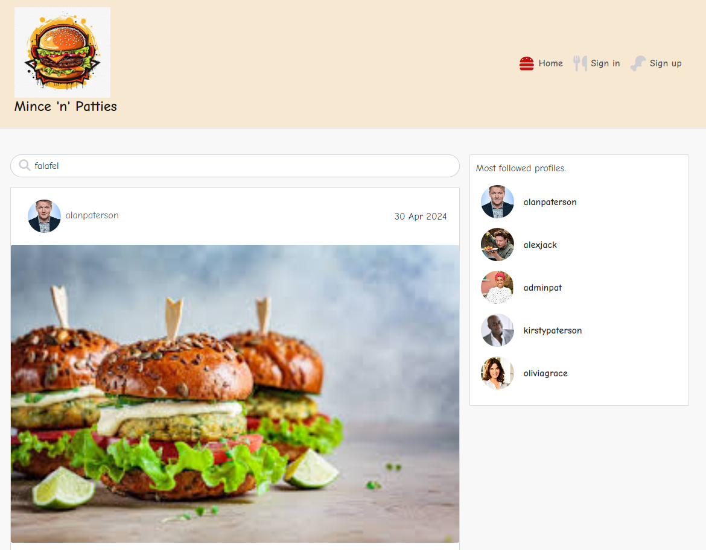

# Mince 'n' Patties

Mince 'n' Patties is my fifth and final portfolio projectand is a content sharing platform focusing on user's interest in food and anything food based. Primarily it is for subscribers to post pictures of any recent meals, creations or experiences, eventually leading to exclusive content for VIP members and recipe sharing at a later date.

The main goal of this project is to build a community where ideas, thoughts and opinions can be shared to generate interesting discussions with others, and to provide culinary inspiration .

The full platform is available to view [here](https://8000-alanpaterson-djangorest-0yj0z1q8uhy.ws-eu110.gitpod.io/).

## Front end Documentation

The front end of this application has full CRUD functionality so that users can register, log-in, like and comment on other posts and also upload their own content.

The landing page is bright, informative and eye-catching and allows you to view the existing feed via the homepage, sign in or sign up for your own account.

 

 

The sign in page allows you to access further content by inputting your username and password as standard.

 

 

If you navigate to this page but don't already have an account you are prompted to click on 'Sign up now!' And with such mouth watering photography already on display, why wouldn't you?!

The sign up page has further enticing photography and is of a standard format.

 

Deployment process - step by step guide on how to deploy the front end app

Component usage - details on the use of React components inc reusable ones

CRUD functionality

## Back end Documentation

API Overview a description of the API and its functionality and how it integrates with the Front end

Databasedesign - structure of the database, including custom models used (wanted to incorporate two additinal models which would be recipe sharing and 'exclusive' content for VIP members)

Security measures - detials on security practices in the back end including handling of sensitive data

Deployment - step by step instructions

## Code Standards & Practices

Front end code standards - information on coding standards followed in the front end (eg JSK, modular component use)

Back end code standards - Python coding standards followed, adhering to PEP 8 guidelines

Testing and Version Control

Manual testing - documentation of manual testing procedures and results fro both front end and back end - **this is mandatory**

Version control - use of github for version control

## Agile Project Management

User stories

Explanation of Agile Methodolgies used such as sprint planning and Kanban Boards 

