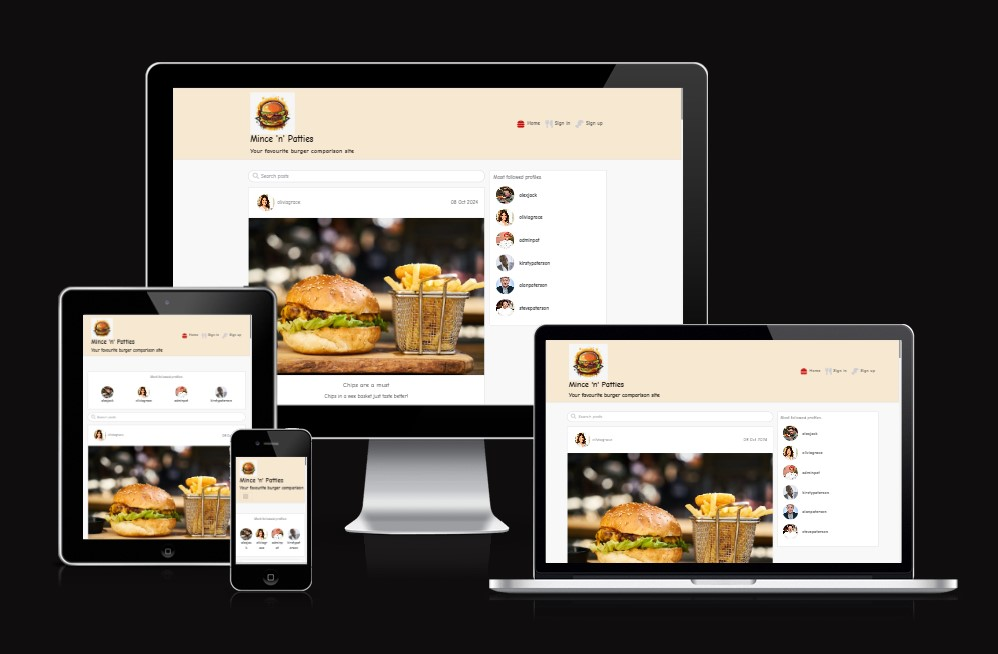

# Mince 'n' Patties

Mince 'n' Patties is my fifth and final portfolio project and is a content sharing platform focusing on user's culinary interests. Primarily it is for subscribers to post pictures of any recent meals, creations or experiences, eventually leading to exclusive content for VIP members and recipe sharing, for example, at a later date.

This project closely followed the Moments walkthrough to allow me to further my skills and knowledge using a reliable, trustworthy source material. Any duplication or use of specific code is completely unintentional and all images used are for educational purposes only.

The main goal of this project is to build a community where ideas, thoughts and opinions can be shared to generate interesting discussions with others, and to provide culinary inspiration .

The full platform is available to view [here](https://django-rest-ap-9a62d525c1f0.herokuapp.com/).

The initial concept was for the website to be easy to navigate and simple to understand. The planning of the site was via user stories and the project can be found [here](https://github.com/users/alanpaterson82/projects/10), with the basic premise outlined below for the landing page.

## Wireframe

### Landing Page:

 

## Front end Design and Documentation

The React front end of this application has full CRUD functionality so that users can register, log-in, like and comment on other posts and also upload their own content.

The landing page is bright, informative and eye-catching and allows you to view the existing feed via the homepage, sign in or sign up for your own account.

 

 

The sign in page allows you to access further content by inputting your username and password as standard.

 

 

If you navigate to this page but don't already have an account you are prompted to click on 'Sign up now!' And with such mouth watering photography already on display, why wouldn't you?!

The sign up page has further enticing photography and is of a similarly standard format.

 

 

Once logged in there are various options as detailed below:

 

 

- ADD POST - upload your own content to share with the world!
- Home - return to the homepage to review the initial content
- Feed - look for likes, comments and inspiration!
- Hot stuff - your own personal file of everything that you have liked so far
- Sign out - leave the platform, until next time!
- Profile - review your details and edit them as you wish eg profile picture, password or username.

 

You can also choose to follow and unfollow other users to build your network, as well as liking and commenting on other posts.

 

 

 

The front end of this application allows for full CRUD functionality and subscribers can...

- Create their own content
- Read others content
- Update their personal details and edit their posts
- Delete their posts and comments 

 

The current custom models are the user and profile options, however, with further development there is scope for much more interactive content including but not limited to, recipe sharing, polls on favourite foods, meal planning suggestions and restaurant recommendations.  

VIP members can also access exclusive offers such as competitions and giveaways.

 

## Colours, Fonts and Images

### Colours
### Fonts
### Images

 

## Back end Documentation

The back end Django Rest aspect of this application is there to allow full management of the accounts and for Superusers to carry out administrative tasks as needed.

To allow for easier debugging and a more simplistic view of all of the code, I chose to merge the front and back end aspects prior to submission. 
Deployment involves the following steps via Heroku;

 

- Logging in to the Heroku dashboard
- Clicking on 'New' then 'Create new app'
- Choosing a unique name for the app and clicking 'create app'
- Clicking on the 'Resources' tab and deleting any existing add-ons
- Navigating to the Settings tab and clicking on 'Reveal Config Vars' and updating as required with all of the below fields

  

 

## Technologies Used

- HTML, CSS, Javascript
- React.js
- Django Rest
- Bootstrap.js

 

Other

- ElephantSQL
- GitHub
- Heroku for deployment
- Cloudinary
- Chrome Developer Tools to test responsiveness, inspect all pages and generate a Lighthouse report
- Font Awesome for all icons and fonts
- Pexels for images
- 'Am I Responsive' to demonstrate suitability on all devices
- CI's Python Linter for automated testing of the Python code
- W3C Markup Validator to test the HTML code
- W3C CSS Validator to test the CSS code

 

## Browser Compatibility

- Tested in Google Chrome and on an iphone 13 Pro Max

  

## Manual Testing

Due to time constraints and a significant number of issues encountered during the design of this project, there was limited testing undertaken, but this is to be factored into any future projects to further enhance my knowledge of this area, it is fully understood how important this is. Prior to submission there were are number of errors highlighted via the W3C Markup and CSS validation systems. These will be looked into and corrected as part of the ongoing learning process.

 

 

 

 

## Bugs Resolved & Unresolved

- There were issues with code not 'auto-importing' so this was completed manually with extra diligence needed to ensure that this was being completed accurately
- Due to confusion with working in the development environment, there was significant time spent on attempting to resolve the following issues

 

1. The sign in page was not saving user details and in order to continue any user would have to sign up repeatedly
2. The API was not 'styled' when logging in as a superuser
3. Posts were not uploading when clicking 'create' and cancelling out of that screen did not return to the 'page not found' page as expected
4. When creating a new user it repeatedly defaulted to the superuser details with broken avatar and image links

 

All of the above issues were initially resolved by removing DEV - 1 from the config vars in Heroku.

- Sourcing images of the correct size and dimensions proved difficult 
- My Cloudinary structure is incorrect but has now been resolved - this was also contributing to broken image links
- The Admin page is no longer styled when deployed via Heroku and since deploying for the final time I can no longer access the backend
- Images are now not uploading with new posts

 

Although the number of errors, warnings and broken links is very unfeasibly high for what should be a polished, interactive and user friendly platform, all of these issues are an opportunity to further develop my knowledge.

The following resources were utilised when trying to resolve all of the above;

- Tutor Assistance
- Stack Overflow
- The Slack Community
- Mentor Sessions
- Google

## Future Actions 

The below will be actioned either via a cloned repository or prior to my portfolio being completed.

- Significantly more testing to ensure that everything is in working order
- Detailed database schema diagrams and an improved structural approach to planning
- User stories with the addition of labels and milestones
- Debugging
- Improved styling
- More independent code writing, and not relying so heavily on the walkthrough projects
- Increased functionality and an improved user experience
- Additional features such as recipe sharing and restaurant reviews
- Additional users stories are to be included covering each scenario across the website 
- Improved labelling and milestones on the project board

## RESUBMISSION

- Lacking in the amount of required models or no models present
- API data is not displayed effectively on the front-end, or is not manipulatable, such as to severely hamper user experience - post details are not displayed on the post detail page
- The create post feature seemed to have an issue with showing the post after it was created, trying to comment or like the newly created post caused a 400 error yet nothing was shown to the user. I could see by refreshing that the post had indeed been created. It seemed like the issue was with the post detail page. It would also not show the image and the number of comments was NaN (not a number)
- Post details are not editable, and a user cannot delete their posts
- On a post detail page, the post image is not displaying
- Database Schema is limited in scope to that presented on the course walkthrough project
- The design process and its reasoning are not documented and/or wireframes, mockups and diagrams created as part of the design process are missing from the README
- No indication of the use of Github project or similar tool for the tracking of project management methodology
- No presence of user stories in the documentation
- No documentation of the use of reusable React components, understanding of React architecture is not apparent
- The header image on mobile was a little bit large, taking up almost half the available space
- The icons don't look right anymore at the top of the homepage
- Manual testing steps are missing or lacking in any meaningful details for the Back-End application
- The Python code style generally conforms to the PEP8 style guide with a few exceptions such as lines too long and no new line at end of file
- Some of the git commit messages were identical and should be more specific
- There is placeholder text present - 'popular profiles for desktop' and popular profiles for mobile' (PostPage.js)
- UX/ UI issues are present that may hamper a user's ability to understand and/or interact with the application
- The site is confusing and should only be a burger comparison site
- Images on READMe have been changed
- Link on READMe is wrong to view the project

