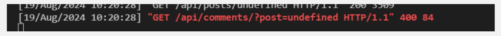

# Mince 'n' Patties

Mince 'n' Patties is my fifth and final portfolio project and is a content sharing platform focusing on users culinary interests. Primarily it is for subscribers to post pictures of any recent (burger related) meals, creations or experiences, post opinions and generate discussion points as well as sharing recipe ideas. Eventually there will be access to exclusive content for VIP members, for example, as the site develops.

This project closely followed the Moments walkthrough to allow me to further develop my skills and knowledge using a reliable, trustworthy source material. Any duplication or use of specific code is completely unintentional.

The main goal of this project is to build a community where ideas, thoughts and opinions can be shared to generate interesting discussions with others, and to provide culinary inspiration.

The full platform is available to view [here](https://django-rest-ap-9a62d525c1f0.herokuapp.com/).

The initial concept was for the website to be easy to navigate and simple to understand. The planning of the site was via user stories and the project can be found [here](https://github.com/users/alanpaterson82/projects/10), (two user stories remain 'in progress' as further work is needed for them to be fully functional). The basic premise is outlined below for the landing page.

## Wireframe

### Landing Page:

## Data

### Entity Relationship Diagram

 

## Front-end Design and Documentation

The React front-end of this application has full CRUD functionality so that users can register, log-in, like and comment on other posts and also upload their own content.

The landing page is bright, informative and eye-catching and allows you to view the existing feed via the homepage, sign in or sign up for your own account.

 

 

The sign in page allows you to access further content by inputting your username and password as standard.

 

 

If you navigate to this page but don't already have an account you are prompted to click on 'Sign up now!' And with such mouth watering photography already on display, why wouldn't you?!

The sign up page has further enticing photography and is of a similarly standard format.

 

 

Once logged in there are various options as detailed below:

 

 

- Post - upload your own content to share with the world!
- Contact - get in touch with your views and feedback
- Recipes - upload reciped for others to enjoy
- Home - return to the homepage to review the initial content
- Feed - look for likes, comments and inspiration
- Hot stuff - your own personal file of everything that you have liked so far
- Exit - leave the platform, until next time!
- Profile - review your details and edit them as you wish eg profile picture, password or username.

## Custom Models

The initial process (although currently incomplete) was as follows;

- created apps
- updated models.py
- set up serializer
- updated views.py
- updated urls.py
- updated project urls

## Example of Custom Model - Contact Page

You can also choose to follow and unfollow other users to build your network, as well as liking and commenting on other posts.

 

 

 

The front end of this application allows for full CRUD functionality and subscribers can...

- Create their own content
- Read others content
- Update their personal details and edit their posts
- Delete their posts and comments 

 

The current custom models are the user and profile options as well as a 'contact us' form and recipe sharing page, however, there is scope for much more interactive content including but not limited to, polls on favourite foods, meal planning suggestions and restaurant recommendations.  

VIP members could also access exclusive offers such as competitions and giveaways.

 

## Colours, Fonts and Images

### Colours

The colours used are subtle with contrasting tones for the icons to ensure ease of visibility and navigation. They were also chosen to represent various components of a burger.

 The bun
 The cheese
 The tomato sauce

### Fonts

The font used is Comic Neue which is quirky and playful as the site doesn't take itself too seriously and this choice reflects that.

### Images

The images are attractive and welcoming to encourage interaction with the posts and to delve deeper into what the site can do. The majority are from Pexels, and all images used are for educational purposes only.

 

## Use of Reusable React Components (Examples)

 

* Form and Button, imported to ContactCreateForm.js and RecipesCreateForm.js 
* Asset.js (const Asset)
    - For when a page is loading and a spinner is to be displayed
* Avatar.js (const Avatar)
    - For handling default Avatar images
* MoreDropdown.js (const MoreDropDown)
    - For users to edit a comment, for example. Used in Post.js, ProfilePage.js and Comment.js and MoreDropdown.js
* Navbar.js (const NavBar)
* SignUp.js (const SignUpForm)
    - Allows users to register their details
* Comment.js (const Comment)
    - Allows a comment to be posted, edited or deleted

 

## Back-end Documentation

The back-end Django Rest aspect of this application is there to allow full management of the accounts and for Superusers to carry out administrative tasks as needed.

To allow for easier debugging and a more simplistic view of all of the code, I chose to merge the front and back end aspects prior to submission. 
Deployment involves the following steps via Heroku;

 

- Logging in to the Heroku dashboard
- Clicking on 'New' then 'Create new app'
- Choosing a unique name for the app and clicking 'create app'
- Clicking on the 'Resources' tab and deleting any existing add-ons
- Navigating to the Settings tab and clicking on 'Reveal Config Vars' and updating as required with all of the below fields

  

 

## Technologies Used

- HTML, CSS, Javascript
- React.js
- Django Rest
- Bootstrap.js

 

Other

- ElephantSQL
- GitHub
- Heroku for deployment
- Cloudinary
- Chrome Developer Tools to test responsiveness, inspect all pages and generate a Lighthouse report
- Font Awesome for all icons and fonts
- Pexels for images
- 'Am I Responsive' to demonstrate suitability on all devices
- CI's Python Linter for automated testing of the Python code
- W3C Markup Validator to test the HTML code
- W3C CSS Validator to test the CSS code

 

## Browser Compatibility

- Tested in Google Chrome and on an iphone 13 Pro Max

  

## Manual Testing

Due to time constraints and a significant number of issues encountered during the design of this project, there was limited testing undertaken, but this is to be factored into any future projects to further enhance my knowledge of this area, it is fully understood how important this is. 

Testing attempts resulted in the following errors, stil to be resolved;

The W3C Markup Validator and W3C CSS produced the following results;

 

 

 

 

The performance is disappointing and will be reviewed and improved wherever possible.

 

## Bugs Resolved & Unresolved

- There were issues with code not 'auto-importing' so this was completed manually with extra diligence needed to ensure that this was being completed accurately
- Due to confusion with working in the development environment, there was significant time spent on attempting to resolve the following issues

 

1. The sign in page was not saving user details and in order to continue any user would have to sign up repeatedly
2. The API was not 'styled' when logging in as a superuser
3. Posts were not uploading when clicking 'create' and cancelling out of that screen did not return to the 'page not found' page as expected
4. When creating a new user it repeatedly defaulted to the superuser details with broken avatar and image links

 

All of the above issues were initially resolved by removing DEV - 1 from the config vars in Heroku.

- Heroku does not appear to be deploying correctly - all of my amended code is showing on the frontend but does not appear to be pulling through to Heroku or updating at the backend 
- My Cloudinary structure is incorrect but has now been resolved - this was also contributing to broken image links
- The Admin page is no longer styled when deployed via Heroku and since deploying for the final time I can no longer access the backend
- There are ongoing issues with the CRUD functionality on the post detail page - the option to edit and delete posts is not available and the avatar image link is broken - there is an ongoing disconnection between posts and their owners

 

There had also been a further error, but during a Tutor session this appeared to have resolved itself and is no longer showing;

 

 

- The custom models have been added to the back end, but are not interactive with the front end - an issue that will also be looked at on an ongoing basis until it is corrected
- The Python code style generally conforms and any obvious deviations were amended
- The infinite scroll function was working successfully initially but has since become an issue, again resulting in poor UX, but will be fixed in future

 

The following resources were utilised when trying to resolve all of the above;

- Tutor Assistance
- Stack Overflow
- The Slack Community including Workflow requests
- Mentor/ Tutor one-to-one Sessions
- Google
- Diffchecker

 

Although the number of errors, warnings and broken links is unfeasibly high for what should be a polished, interactive and user friendly platform, all of these issues are an opportunity to further develop my knowledge. Attempts were made to fix every issue and extensive research was undertaken using a variety of resources but ultimately they remain unresolved, resulting in severely affected UX. I will continue to work on this to improve the quality of my work going forward.

## Future Actions 

- Significantly more testing to ensure that everything is in working order
- The addition of more detailed labels and milestones added to the Project Board
- Debugging
- Improved styling
- More independent code writing, and not relying so heavily on the walkthrough projects
- Increased functionality and an improved user experience
- Additional features such as restaurant reviews and VIP access to the site

